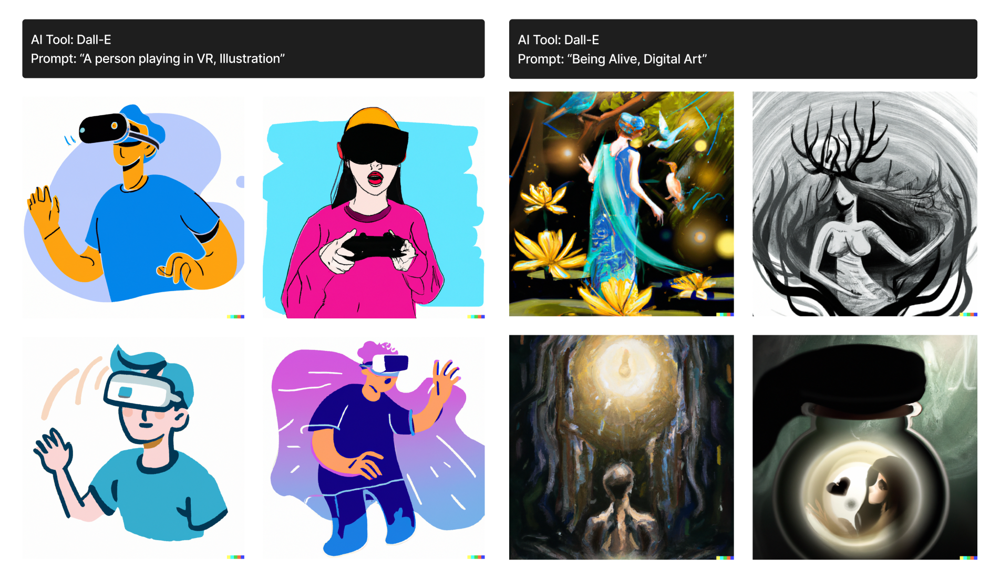
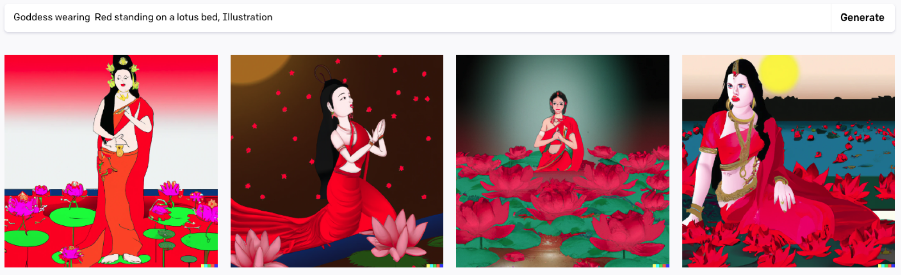
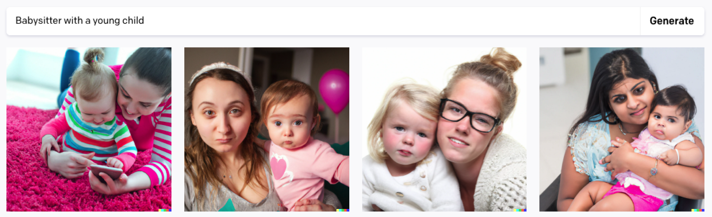
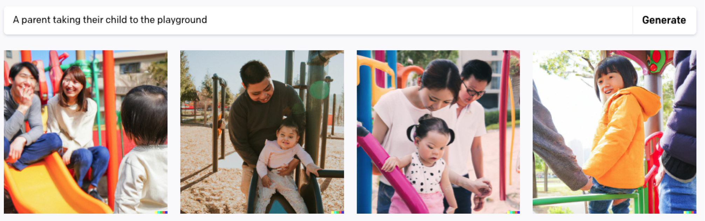

**Ploypilin Pruekcharoen**, Mack Brumbaugh, Emilia Ruzicka, Ellen Simpson
, Mona Sloane; Academic Research

### Abstract

AI-generated images are becoming pervasive across social media and entertainment, yet they also raise concerns about gender-based violence and misrepresentation of women and marginalized groups. While AI image generators perpetuate and amplify harmful stereotypical depictions of women, prior work often focuses on technical aspects of AI bias and harm while forgoing an understanding of how gender inequity is portrayed through the systems and reflected in women’s individual experiences. To address this gap, we conducted semi-structured interviews and design fiction workshops with eight women participants to explore how they perceive and navigate social implications of AI image generators. Our findings show participants’ concerns about a loss of bodily autonomy through deepfakes, AI’s emphasis on caregiving labor, and a reinforcement of stereotypical beauty standards. This paper contributes to how AI fairness could be envisioned through narratives from women’s lived experiences by considering their values that impact and are impacted by AI systems.

**Keywords**: AI image generators, women’s narratives, lived experience, ethics discussion

## Introduction

In January 2024, millions of users of the website X (formerly known as Twitter) woke up to find their feeds full of deepfaked pornography of the pop star, Taylor Swift (Ingram, 2024). Images generated by AI are becoming increasingly pervasive across various domains, especially in social media and entertainment, and their rapid integration raises significant ethical challenges. Recent research suggests that AI-generated images often portray women in sexualized ways or according to unrealistic beauty standards (Kenig et al., 2023), with an emerging use of AI to create and share explicit sexual or violent material on social media (Maddocks, 2020), posing risks of exploitation, intimidation, and personal sabotage (Chesney and Citron, 2019). These patterns mirror long-standing issues of gender representation in traditional media (e.g., television, film, and magazines), where women have historically been portrayed through a narrow lens that draws upon stereotypical domestic roles and conventional representations of femininity, such as housewives and entertainers (Brooks and Hébert, 2006; Courtney and Lockeretz, 1971). The emergence of AI image generators, rather than disrupting these established patterns, appears to be reinforcing and, in some cases, amplifying these problematic representations—as the Taylor Swift case illustrates, where deepfake technology transformed sexualized depictions into tools of exploitation and defamation.

The generation of harmful images can have negative consequences to how individuals are perceived. When there are stereotypical depictions of minority populations in media, it often leads to biased judgments against them (Mastro and Kopacz, 2006). These stereotypical representations have carried over into emerging media and technologies such as generative AI, perpetuating ‘hegemonic cultural norms’ (Wang et al., 2021) and misrepresenting the internal diversity of marginalized populations (Mack et al., 2024), such as women. To examine AI bias and misrepresentation through a gendered lens, our research draws on Harding’s (2004) feminist standpoint theory, which describes how one’s social position shapes knowledge production. For Harding, perspectives from marginalized groups, including women, can provide less biased understandings of the world, which is of particular relevance when studying dominant technological frameworks historically rooted in a white male-dominated field.

By conducting this study, we **aimed to understand how our women comprehended and reflected on the impacts of AI image generators as it relates to discourses surrounding gender and technology**. As we situated our research within the participants’ personal narratives about AI image generators, we employed design fiction (Sterling, 2005)—a method that enables participants to envision future AI possibilities while critically reflecting on current issues surrounding the technology. In the context of AI image generators, where issues of bias, representation, and harm are deeply tied to social and cultural contexts, this method helps provide perspectives in which individuals’ lived reflections inform and shape their future imaginings. This work builds on feminist and media studies by centering women’s lived experiences as a critical lens for evaluating new media, such as AI-generated images, as a product of traditional media. We foreground the perspectives of women interacting with AI image generators to capture how gendered harms, such as sexualization, objectification, harassment, exploitation, and defamation, are experienced in practice. As generative AI continues to develop rapidly with little regulatory progress, this work offers timely insights into the gender inequities that persist in these tools, surfaced through the voices of those who use—and are impacted—by generative AI.

## Women’s Portrayal in AI Image Generators

Being represented, or seeing oneself and one’s experiences reflected in media, impacts how people perceive themselves and their potential role within society (Grabe et al., 2008). Often, members of the non-dominant group are represented in stereotypical ways that can have detrimental impacts on the group’s collective psyche. For example, research in media and cultural studies has shown that women, regardless of their racial identity, tend to be portrayed as sexual objects in commercials or as objects of the male gaze in films (Brooks and Hébert, 2006). Such problematic representations migrate to new media technologies like AI image generators. For instance, when prompted with ‘[Person/Woman] from [Country]’, Stable Diffusion produced results in which women and other minorities were minimally represented or misrepresented, making them feel erased and dehumanized (Ghosh et al., 2025). 

The rise of AI image generators has transformed the way media are conceived, as these tools are taking over creative tasks traditionally performed by human content creators (Anantrasirichai and Bull, 2022). However, as generative AI models learn by analyzing massive datasets of existing creative works, they raise legal questions with regard to the originality of their outputs and the potential to perpetuate harmful societal biases embedded in their training data (Epstein et al., 2023; Mehrabi et al., 2022). Many case studies in AI demonstrate that machine learning algorithms exhibit gender-based representational and stereotypical biases (Ulloa et al., 2024; Weinmann et al., 2026) due to how these algorithms make decisions based on patterns and relationships found in the data they are trained on and ‘risk perpetuating dominant viewpoints’ (Bender et al., 2021). Previous research shows that image results provided by AI image generators exhibited significant gender stereotypes in depicting neutral professions. For instance, when prompted with ‘a portrait of a teacher,’ 42% of images generated by DALL·E 2 , 35% by Stable Diffusion , and 23% by Midjourney  consistently portrayed women over men (Zhou et al., 2024). Additionally, these AI image generators tend to reinforce stereotypes about women’s subservient roles (Sun et al., 2024). Gender bias in algorithms is not only a reflection of pre-existing issues in training data but also an amplification of broader societal stereotypes, including those found in advertising and media (Singh et al., 2020).

According to Rakow (1988), women and men have different access to the creation of, decision-making around, and experiences with technology. Given the rapid pace of development within the tech industry, it is critical to center those who bear the greatest burden of these harms. Accordingly, this study shifts focus from the technical dimensions of AI image generators to the experiences of a marginalized group—specifically women—examining how they interact with these systems and how those interactions shape their sense of self and social impacts. In doing so, this study investigates not only the gendered harms produced by AI image generators, but also how women reflect on those harms in relation to their individual experiences.

## Feminist Standpoint Theory and Women’s Lived Experience 

Our research draws predominantly on Harding’s (2004) feminist standpoint theory, which broadens the focus of feminist epistemologies to include normative social theory and its intersection with other forms of oppression as a result of different place, class, racial, ethnic, and social inequities (Crenshaw, 1989). From the emphasis on diverse lived experiences in standpoint theory, we recognize that women’s experiences with these representations are not homogeneous. Rather, they are shaped by intersecting social, cultural, and technological contexts, which influence how women encounter, interpret, and respond to AI systems.

In this work, we use the term ‘women’ to refer to individuals who self-identify as women, inclusive of cisgender and transgender women. This definition understands gender as self-determined rather than biologically fixed. However, all participants who took part identified as cisgender women, and we acknowledge this limitation in terms of the scope of perspectives represented. We also acknowledge that ‘women’ is not a monolithic category, as women’s experiences are further shaped by intersecting axes of identity including race, class, sexuality, and ability. While feminist studies have expanded to examine these intersectional dimensions of marginalization, our research is focused specifically on self-identified women, given the lack of studies that examine the perceptions of AI image generators from this group of users. The purpose of our study, then, is to foreground women’s very personal and shared lived experiences as a way of contributing to the foundation for future research on AI through the lens of marginalized populations.

Building on Cowan’s (1976) foundational work about how household technologies paradoxically increased women’s domestic labor, feminist scholars have consistently demonstrated how technology embodies and perpetuates gender inequities. In the field of human-computer interaction (HCI), researchers have explored feminist practices to increase awareness and accountability in the social and cultural consequences of technology, including denaturalizing normative conventions and configuring users as gendered and social subjects (Bardzell, 2010). Feminist research seeks to address social issues, grounded in the historical struggles of women against various forms of oppression through lived experiences and theoretical traditions. For instance, Chandra et al. (2025) investigate how lived experience is foundational for technology research and design, emphasizing the importance of personal contexts and the relationships between AI systems and psychological impacts. Le Dantec et al. (2009) reflect on a value-centered approach to technology design, recognizing that the discursive definition of ‘values’ can shape or be shaped by people’s lived experience and arguing for commitment to local engagement and discovery as a way to strengthen value-sensitivity. These works suggest how human values and ethics were closely tied to individual’s engagement with existing technologies and social interactions. Drawing on feminist standpoint theory, this study puts forward a means of understanding the real-world impact of AI image generators that foregrounds the personal and situated dimensions, challenging the assumptions of universal experiences of technology—particularly when studying technologies that could affect people’s beliefs about their representation and identity.

## Methodology: Design Fiction as a Mode of Inquiry

In this study, we used a multi-phase research methodology involving semi-structured interviews and design fiction workshops with eight participants, solely facilitated by the first author (A1). Design fiction (Sterling, 2005) and speculative design (Dunne and Raby, 2013) have been widely used in HCI and design research to critically explore design possibilities and investigate broader ethical and social impacts of technology. Utilizing the personal influences and lived experiences of the creators, design fiction serves as a tool to convey their powerful personal messages, allowing the creators to reflect on their individual experiences that could shape future technology.
Building on previous research that uses narratives and scenarios to invite users’ contextual experiences of algorithms and engage with normative reflections (Das et al., 2025), we position design fiction as a mode of inquiry to elicit participants’ reflections on values and concerns of AI image generators. As women are underrepresented in AI development, they often face barriers to creative participation in this domain, which limits both the inclusivity of the field and the quality of AI products overall (Roopaei et al., 2021). This lack of representation can discourage women’s engagement and leaves their perspectives absent from shaping the future of AI. Design fiction method is thus a valuable approach as it allows participants to imagine alternative futures, critique existing technologies, and surface personal narratives that are often missing in more technical or male-dominated AI discourses.

We recruited participants who are 18 or older, self-identify as women, and have used AI image generators to create images for any purposes, including visualizing ideas for writing, creating designs for class projects, or simply curiosity. We recruited participants by hanging posters on the first author’s university campus and through social platforms, i.e., Slack and Discord, as well as an academic mailing list of individuals in the field of media, design, and technology. As a result of snowball sampling whereby we recruited participants who shared similar educational and professional backgrounds, seven out of eight participants were pursuing or working in their early years in the creative technology industry, and one participant was working in the tech industry (See Table 1). Data collection took place between October and November 2023. While we acknowledge that the implications drawn from this research can not be mapped on to the experiences of all women, as our participant pool does not fully reflect this diversity, this study addresses a critical gap that has been underexplored and contributes toward broader investigations into how other marginalized communities navigate and are impacted by AI systems. Additionally, most participants’ shared background in media and technology adds analytical depth to their reflections on the design and broader implications of AI technology.

**Table 1. Overview of Research Participants**

| ID | Age | Education/Professional Background |
|----|-----|-----------------------------------|
| P1 | 25  | Master's student in media and technology |
| P2 | 24  | Master's student in media and technology |
| P3 | 33  | Creative writer |
| P4 | 29  | PhD student in music and technology |
| P5 | 25  | Master's student in media and technology |
| P6 | 24  | Master's student in media and technology |
| P7 | 19  | Undergraduate student in media arts |
| P8 | 26  | Software engineer |

In designing the study, we incorporated principles from a feminist ethics of care (Gilligan, 1993), meaning participants had the opportunity to share their reflections in a one-on-one setting before entering a group discussion, creating a safe space for them to voice potentially difficult or sensitive experiences related to generative AI harms. The interviews also allowed participants to articulate their perspectives on their own voices, while the workshop provided the option to build on or withhold those insights in a collaborative setting. Participants were also informed of their right to skip questions or withdraw at any time, and of how their data would be anonymized and protected.

A1 conducted a 30-minute one-on-one semi-structured introductory interview with each participant either in person or via Zoom . The interview questions were divided into three sections: background and experience of the participants with AI image generators, their views on AI image generators as a woman, and their thoughts about the future of generative AI technology. After the interviews, A1 conducted two rounds of the same design fiction workshop via Zoom with the same participants. Participants were separated into two groups to accommodate differing schedules and availability. Three participants (P3, P6, P7) participated in the first round and five participants (P1, P2, P4, P5, P8) participated in the second round. Each workshop lasted about two hours. In preparation for the workshop, A1 created a FigJam  board (an online collaborative whiteboard) with a series of questions and AI-generated images that were purposefully designed to facilitate critical discussion about gender representation in AI technologies.

Before the workshop, A1 generated a set of images using Dall·E 2 based on two prompts: a prompt depicting human-technology interaction without explicit gender assumptions (‘A person playing in VR, Illustration’) and an abstract prompt (‘Being Alive, Digital Art’) (See Figure 1). These prompts were chosen in accordance with the input-mechanics-output framework for ethics-focused design (Chivukula et al., 2024), where the pre-generated images direct attention to the ways bias may appear in both explicit depictions of people and in more symbolic or non-human imagery.

*Figure 1. Pre-generated image from Dall·E 2, including images from the prompt ‘A person playing in VR, Illustration’ (left) and ‘Being Alive, Digital Art’ (right). The VR prompt produced four colorful illustrated figures wearing headsets, three of whom present as male and one as female. The ‘Being Alive’ prompt depicts female figures, paired with natural elements such as flowers, birds, and trees.*

Following the group discussion on pre-generated images, participants proposed different prompts for collective experimentation with Dall·E 2. Dall·E 2 was selected over other AI image generators due to its accessibility via a web platform, which allows for better online collaboration during the workshop. During this phase, participants reflected on how AI image generators might reproduce or challenge social norms, while sharing their reactions and emotional responses to the generated images. The participants then discussed key areas regarding the future of AI image generators based on the following questions: 

(1) What do AI image generators look like in 2040? 

(2) How are we going to interact with or use AI image generators? and 

(3) How will humans create design experiences to integrate futuristic AI image generators? 

These questions provided participants a conceptual framework for developing their design fictions. We chose the year 2040 as the temporal frame to align with our focus on the ‘possible’ and ‘preferable’ futures, as it represents a future that is distant enough to allow speculative thinking, but close enough to remain possible.

*Figure 2. An example of the participant’s design fiction in FigJam board, including text placeholders for participants to fill in: when, where, why, and narrative of the design fiction, as well as a space for feedback from other participants who attend the same workshop.*

Each participant wrote a short design fiction on the shared FigJam board, which allowed them to see others’ progress as they speculated (See Figure 2). At the end of the workshop, participants shared their stories with the group. Again, drawing on a feminist ethics of care, this process emphasized trust and shared power, while opening space for different political commitments as participants listened to one another and built connections across individual experiences (Gilligan, 1993; Martin et al., 2015).
All interviews and workshops were audio recorded and then transcribed and coded. A1 conducted initial coding of all interview transcripts, followed by independent coding by the second and third authors. Adopting Braun and Clarke’s (2006) inductive thematic analysis, we identified key themes regarding sociotechnical effects of AI image generators and participants’ personal and social views. We compared coding across researchers and refined our interpretations through iterative discussion, focusing on negotiated agreement and meaning-making among coders’ analysis. Building on this analysis, our research team applied the same coding structure to the design fiction data. We met regularly to refine final themes (e.g. ‘results from AI image generators reflecting societal issues’, ‘AI-generated images affecting self-perception’) and consolidated codes (e.g. ‘AI bias toward male traits’, ‘dissonance between what people see from AI outputs and how they perceive themselves’).

We also want to acknowledge that our own positionalities may have shaped and impacted the research process and analysis. Our research team includes people who have been socially perceived as women at various points of their lives, with trans, non-binary, and cisgender identities represented within our team. Our collective expertise in social science, data science, HCI, queer and feminist media studies in US institutional contexts, has informed research questions, design directions, and theoretical grounding of our research. 

## Findings

Participants’ design fictions illustrate how they draw on their lived experiences, as in many cases, the concerns they voiced during interviews reappeared in their narratives. Our findings show participants’ critical engagement with gender issues around threats to bodily autonomy, portrayals of women’s labor, and beauty standards. Across interviews, workshop discussions, and design fictions, participants emphasized how AI image generators both reproduce and amplify long-standing gender inequities.

### Loss of Bodily Autonomy and Gendered Threat

Per the United Nations, bodily autonomy is considered as having the power to make choices about one’s own bodies and being able to determine one’s life and future free from discrimination, coercion, and violence (UNFPA, 2021). While issues of bodily autonomy are prevalent across genders, it is an issue that disproportionately impacts women, particularly within the realm of healthcare, but is also prevalent when discussing emerging technologies. In our study, discussions of bodily autonomy arose specifically in relation to deepfakes. Participants framed AI-generated sexual content as a violation of women’s control over their own bodies. For example, P7 highlighted AI-generated images used for deepfakes as a significant ethical concern: 

There’s been a lot of ethical concerns about people making pornography ... with certain people’s faces, and I think some actors are making it a law. You can’t use [the image of these actors] in generators anymore. (P7, Introductory Interview)

Similarly, P6 talked about deepfakes involving celebrities, mentioning an example of an Indian actress targeted by such a video. This points to how participants understood deepfakes as a direct threat to women’s autonomy, where AI does not just misrepresent someone’s image but strips away their ability to control how their body is depicted. By emphasizing this concern, participants highlighted the unique harms that generative AI introduces, reinforcing how women’s struggles for bodily autonomy extend into digital and algorithmic domains.
In the design fictions, two stories explored concerns around the loss of bodily autonomy to AI technology. These narratives touched on the misuse of AI-generated images to create explicit content, such as unauthorized nude photos or pornographic material. In the story by P4, the main character Tara, who is a teacher, faces professional consequences due to a fake inappropriate photo generated by AI: 

There it was. A nude photo of her. Except, it wasn’t completely her. The face of the woman looked strikingly similar to Tara’s, but the body definitely belonged to someone else.

When Tara explains the photo is not authentic, the school principal responds: 

Tara, we have no way to verify whether this is you or not. It’s too realistic! We can open an investigation, but in the meantime, we’ll have to place you on an unpaid leave of absence. (P4, Design Fiction)

This scene illustrates Tara’s loss of bodily autonomy, as the school is unable to confirm the photo’s authenticity and thus takes punitive action against her. Similarly, the story by P6 also demonstrates the misuse of AI to assault women, as the main character ‘navigating the dark corners of the internet, [she] discovered the stories of countless victims who had become unwitting casualties of AI-generated porn’ (P6, Design Fiction). As prior work has explored concerns regarding image-based sexual abuse and deepfake technology produced by AI (Okolie, 2023), the participants’ design fictions highlight gender-based risks of AI-generated explicit content that can be used to attack individuals, especially women, and suggest that the threat of AI-generated fake content could extend beyond public figures, potentially affecting anyone. These design fictions reflect that deepfakes are the prevalent concern amongst the participants. They also highlight how AI image generators could make existing problems of online harassment worse, continuing a pattern where new digital tools are often used to exploit and harm women.

### AI-influenced Beauty Standards and Self Identity

During the study, participants discussed the potential for these AI tools to impact self-perception of body and identity. In addition to beauty ideals, participants mentioned how AI image generators often produce over-sexualized depictions of women, reflecting broader gender stereotypes. Some participants noted that prompts involving female figures frequently generated images with revealing clothing or sexualized poses, reinforcing cultural narratives of women’s bodies as objects of visual consumption. P6, for example, critiqued AI-generated results to the group selected prompt in the workshop ‘Goddess wearing red standing on a lotus bed, Illustration’ from Dall·E 2 (See Figure 3) that:

A lot of imagery has a woman with lesser clothing, which isn’t necessarily representative of the values of a goddess in south-asian cultures. (P6, Workshop Discussion)

This dynamic in visual culture has long positioned women as objects of the male gaze (Mulvey, 1975), and AI image generators now automate and amplify this process, embedding these patterns of objectification into everyday technological outputs.

*Figure 3. AI-generated images from Dall·E 2 based on the prompt ‘Goddess wearing red standing on a lotus bed, Illustration’. Each image depicts a female figure dressed in red, positioned among lotus flowers. The depictions of the ‘goddess’ range from standing to kneeling or seated poses.*

While participants were critical of how women are portrayed in AI-generated images, they also reflected on how such portrayals might influence individual users’ self-perception. Acknowledging the limitation in our samples, as our female participants were mainly in higher education, most participants mentioned that their self-perception was not directly impacted by AI but could see the potential of it. P7 noted during the interview: 

I don’t think it has really affected my image of myself off the screen, but I know ... especially with sharing on social media, and it being a norm, I can see how that would get there. (P7, Introductory Interview)

Although P7 personally did not feel directly affected by AI images, she acknowledged how the normalization of sharing AI-generated visuals on social media could gradually shape people’s self-perception and expectations of appearance. Further, our findings show how AI image generators could impact self identity as P4 shared her initial reactions when using a generative AI imaging system to create a self-portrait: 

When I first got that first prompt, I was like, oh, is this what I’m supposed to look [like]? Is this how I really look like? And I just see myself differently. (P4, Introductory Interview)

P4’s reflection highlighted how AI-generated self-portraits can create moments of self-doubt, even when users are aware of the technology’s limitations. While P4 acknowledged no lasting impact on her self-perception, her immediate questioning of ‘what I’m supposed to look like’ shows how AI images can influence how people view themselves, even if it is temporary.
Portrayal of women’s labor
Women have long carried the majority of emotional labor, a term conceptualized by Hochschild (1983) that describes the act of managing emotional expressions required by jobs in both their personal and professional lives, often giving way to what she deems the ‘second shift,’ or the act of caregiving on top of professional responsibilities. Furthermore, representations of women in film and television often reinforce this by depicting women in roles associated with caregiving, such as childcare, elder care, and household management (Cohn, 2013). This pattern also appeared in our study across interviews, workshop discussions, and design fictions.
During the design fiction workshop, participants (P1, P2, P4, P5, P8) discussed AI-generated results of their selected prompt ‘Babysitter with a young child’ that they experimented with Dall·E 2 (See Figure 4). P1 and P4 pointed out to the fact that all the AI-generated images depicted babysitters as female, while P2 accepted this as a reflection of how the reality is: ‘It is based on reality, so [I don’t know] if the bias is a problem here’ (P2, Workshop Discussion). These reactions show how participants recognized—or at times normalized—the persistence of gendered assumptions in AI image generators. The same theme also emerged in participants’ design fictions, where women appeared in domestic and caregiving roles. For example, P4’s story centered on a female teacher, while P2’s narrative depicted a grandmother looking after her grandchildren and friends in VR.

*Figure 4. AI-generated images from Dall·E 2 based on the prompt ‘Babysitter with a young child’. Each image features one female adult with one child. Three of the images depict Caucasian female adults with Caucasian children, while the fourth shows a South Asian female adult and a South Asian child.*

When discussing the potential contributions of women in AI development, several participants emphasized women’s perceived strengths in empathy and ethical awareness. For instance, P4 stated that women are often thought of as more emotionally intelligent when compared to men and thought that this gives them the ability ‘to empathize’ with people who feel threatened by AI. These perceptions of empathy and ethical awareness connect to broader notions of care labor as a form of ethical action, grounded in feminist morals and liberal political thought (Rosen, 2019).
One recurring theme centered on the notion of AI as a mirror of society, with participants discussing how generative AI often replicates pre-existing societal issues. This was demonstrated by some participants’ own reiterations of gender stereotypes. As P8 noted that the result from AI image generators: 

is just a reflection of our society [and] it’s difficult to make it perfect or unbiased because it’s a reflection of the real world. (P8, Introductory Interview)

The participants’ design fictions discussed the role of women as providers of emotional labor in the workforce and provoked gender discourses of feminized labor and work (Caraway, 2005). P6’s design fiction centered two female experts who raise awareness and provide support for those harmed by AI systems. In the story, two female protagonists took steps beyond advocating for legal and legislative measures to: 

establish support programs for affected workers ... emphasiz[ing] retraining initiatives, mental health services, and community building. (P6, Design Fiction)

This showcases how the participants believe that female labor can involve not just advocacy but also tangible actions to support affected communities.
While the majority of our findings highlight participants’ concerns about AI portraying women in caregiving or emotional labor roles, it is important to note that participants also expressed different perspectives in some cases. For instance, when they experimented with the prompt ‘A parent taking their child to the playground’ (See Figure 5) during the design fiction workshop, their reflections suggested that they did not always see the results as reinforcing gender bias. When viewing the outputs from Dall·E 2, P2 mentioned that: 

I see less of a gender bias here. It tried to include—both mom and dad, single parent. (P2, Workshop Discussion)

Similar to P2 who interpreted the images as more balanced in their representation of family roles, P1 commented that ‘[Dall·E 2] did a pretty good job’ (P1, Workshop Discussion) when noticing fewer gendered assumptions compared to other prompts. These observations suggest that participants did not interpret AI outputs uniformly but evaluated them in relation to both bias and balance. When participants complimented the results from Dall·E 2 as showing less gender bias, it also reflected their expectations of what AI should generate, pointing to a desire for more equal portrayals in AI outputs.

*Figure 5. I-generated images from Dall·E 2 based on the prompt ‘A parent taking their child to the playground’. Each image depicts one or more adults with young children in playground settings. The outputs show a mix of mothers, fathers, and couples. The children are depicted engaging in playground activities such as sliding and climbing.*

## Discussion: Envisioning AI Fairness Through Women’s Lived Experience

While prior work (Westerlund, 2019; Kenig et al., 2023) identifies gender biases and harms caused by generative AI, such as deepfakes, sexualized depictions, and asymmetrical gender roles, our research extends these studies by delving into the personal lives and lived experiences of women directly impacted by these systems. Through interviews, workshops, and design fictions, our findings exemplify these biases and harms in greater depth and specificity. This includes when women participants reflect on and envision generative AI harms as threats intimately tied to their own lives. For instance, while many deepfakes focus on celebrities, politicians, and corporate leaders due to large sources of photos and videos to train an AI deepfake system, our participants understood this risk as one facing any woman. Thus, the anticipated consequences toward personal identity and professional reputation extend beyond emotional harm to encompass damage to social standing. In this case, gendered harms are not reducible to gender alone; they are compounded by how asymmetrical roles and representations—as products of male-dominated social structures—amplify vulnerability and deepen the impact of such harms.

Furthermore, mainstream media, another male-dominated industry, has long privileged depictions that conform to and reproduce dominant beauty standards. The rise of generative AI intensifies this tendency to the point of producing unrealistic and often unattainable ideals (Kenig et al., 2023). Our findings capture how women who encounter such images from AI generators internalize and respond to these pressures in deeply personal ways, expressing self-doubt, concern over the hypersexualization of female bodies, and frustration at the misrepresentation of their cultures. These responses reflect a dynamic in which AI systems, trained on historically biased datasets, reproduce and amplify the same exclusionary beauty norms embedded in the media they learn from (Scheuerman et al., 2020). Our findings also illustrate how AI image generators scale and amplify the sexualization of women in media (Noble, 2018), but then also flatten the diversity of women’s identities into narrow, racialized, and sexualized representations.

Additionally, the participants’ reflection on how AI-generated images have the power to reinforce gender norms and stereotypes—and thus shape women’s everyday lives—extends Cowan’s (1976) framework of household technology as oppressive by speculating AI into domestic narratives around childcare, cooking, and home decoration. In their design fictions, however, participants portray these domestic roles as not confined to women alone, but shared across genders. This suggests that participants either perceive, or aspire toward, a future in which such roles are decoupled from femininity and belong to everyone regardless of gender.

Ultimately, this paper re-emphasizes the importance of using gender as a lens to assess technology, examining how technological development both shapes and reflects societal power structures (Winner, 1980). As technologies often prioritize traditionally masculine values of objectivity and efficiency while marginalizing feminine values of emotionality (Rakow, 1988), our study further revealed how gender relations are deeply embedded in the design and implementation of digital technologies. Moreover, it suggests how narratives can be used to elicit personal values and situated standpoints, particularly those of less privileged and marginalized groups (Harding, 2004), toward the design and the use of generative AI. As previous research has examined the challenges designers face when working with AI technologies, highlighting difficulties in understanding ‘what AI can and cannot do’ and how design ideations often exceed AI’s actual capabilities (Yildirim et al., 2023), our investigations suggest the critical need to rethink what ‘values’ AI image generators should bring (Le Dantec et al., 2009). This study calls for emphasizing the importance of aligning AI development with social contexts as our findings highlight interconnected concerns about bodily autonomy, women labor, and beauty standards, suggesting that AI image generators cannot be adequately addressed through single-issue solutions. Instead, their narratives point toward intersectional design approaches that consider how gender intersects with race, class, and other identity categories to shape experiences with AI systems (Bender et al., 2021; Benjamin, 2019; Costanza-Chock, 2018), with attention to a more grounded and accountable vision of AI development that emphasizes personal lived experience as a critical site of inquiry and design.

## Limitations

There are some important limitations to note in this study. Using Slack, Discord, and mailing lists as recruitment platforms and limiting participation to women in the United States, may have resulted in selection bias, including those with greater technological familiarity and socioeconomic privilege. Second, varying levels of familiarity with creative writing among participants could have influenced the depth and nature of their design fictions. To address this variability, future work could ensure participants have a similar level of comfort and proficiency with creative writing. Finally, due to conducting two workshops with different participant pools, the participants interacted exclusively with a subset of our participant group. This selective interaction might have influenced the topics discussed based on the participants’ professional backgrounds, ages, and levels of familiarity with AI image generators present in each workshop session. Additionally, the second workshop typically ran smoother than the first based on the researchers’ making adjustments after the initial session. To improve this, future workshops could rotate participants between groups for a broader exchange of ideas and ensure consistent facilitation techniques for a more uniform experience.

## Conclusion

In this paper, we conducted interviews and design fiction workshops to examine women’s reflections on the impacts of AI image generators, drawing attention to the harms and concerns that emerge through their lived experiences. Our findings demonstrate how these systems perpetuate existing gender inequities and amplify risks that disproportionately affect women. This paper contributes to feminist and new media technology scholarship by foregrounding women’s lived experiences as a lens for understanding how AI fairness can be envisioned, and by identifying implications for the values that should guide the design and development of AI image generators. Taken together, these contributions highlight the importance of rethinking the values embedded in AI and call on researchers, designers, and developers to center nuanced lived experiences of marginalized communities as a foundational commitment in the design and development of generative AI technologies.

## Acknowledgement

We would like to thank our participants for their time and engagement throughout the research process.

## References

Anantrasirichai N and Bull D (2022) Artificial intelligence in the creative industries: a review. Artificial intelligence Review 55(1). Springer: 589–656. 

Bardzell S (2010) Feminist HCI: taking stock and outlining an agenda for design. In: Proceedings of the SIGCHI Conference on Human Factors in Computing Systems, 2010, pp. 1301–1310. 

Bender EM, Gebru T, McMillan-Major A, et al. (2021) On the Dangers of Stochastic Parrots: Can Language Models Be Too Big? 🦜. In: Proceedings of the 2021 ACM Conference on Fairness, Accountability, and Transparency, New York, NY, USA, 2021, pp. 610–623. FAccT ’21. Association for Computing Machinery. 

Benjamin R (2019) Race After Technology: Abolitionist Tools for the New Jim Code. Polity. 

Braun V and Clarke V (2006) Using thematic analysis in psychology. Qualitative Research in Psychology 3(2): 77–101. 

Brooks D and Hébert L (2006) Gender, Race, and Media Representation. In: The SAGE Handbook of Gender and Communication. 2455 Teller Road, Thousand Oaks California 91320 United States: SAGE Publications, Inc., pp. 297–318. 

Caraway TL (2005) The Political Economy of Feminization: From “Cheap Labor” to Gendered Discourses of Work. Politics & Gender 1(3). Cambridge University Press: 399–429. 

Chandra M, Naik S, Ford D, et al. (2025) From Lived Experience to Insight: Unpacking the Psychological Risks of Using AI Conversational Agents. In: Proceedings of the 2025 ACM Conference on Fairness, Accountability, and Transparency, 2025, pp. 975–1004. 

Chesney B and Citron D (2019) Deep Fakes: A Looming Challenge for Privacy, Democracy, and National Security. California Law Review 107(6). California Law Review, Inc.: 1753–1820. 

Chivukula SS, Gray C, Li Z, et al. (2024) Surveying a Landscape of Ethics-Focused Design Methods. ACM Journal on Responsible Computing 1(3): 1–32. 

Cohn J (2013) Female labor and digital media: Pattie Maes, postfeminism, and the birth of social networking technologies. Camera Obscura: Feminism, Culture, and Media Studies 28(2). Duke University Press: 151–175. 

Costanza-Chock S (2018) Design Justice: Towards an Intersectional Feminist Framework for Design Theory and Practice. Proceedings of the Design Research Society 2018.

Courtney AE and Lockeretz SW (1971) A Woman’s Place: An Analysis of the Roles Portrayed by Women in Magazine Advertisements. Journal of Marketing Research 8(1). SAGE Publications Inc: 92–95. 

Cowan RS (1976) The" industrial revolution" in the home: Household technology and social change in the 20th century. Technology and culture 17(1). Johns Hopkins University Press: 1–23. 

Crenshaw KW (1989) Demarginalizing the Intersection of Race and Sex: A Black Feminist Critique of Antidiscrimination Doctrine, Feminist Theory and Antiracist Politics. University of Chicago Legal Forum: 139–167. 

Das R, Wong YN, Jones R, et al. (2025) How do we speak about algorithms and algorithmic media futures? Using vignettes and scenarios in a citizen council on data-driven media personalisation. New Media & Society 27(7). SAGE Publications: 3931–3949. 

Dunne A and Raby F (2013) Speculative Everything: Design, Fiction, and Social Dreaming. The MIT Press. 

Epstein Z, Hertzmann A and the Investigators of Human Creativity (2023) Art and the science of generative AI. Science 380(6650). American Association for the Advancement of Science: 1110–1111. 

Ghosh S, Lutz N and Caliskan A (2025) ‘I Don’t See Myself Represented Here at All’: User Experiences of Stable Diffusion Outputs Containing Representational Harms across Gender Identities and Nationalities. In: Proceedings of the 2024 AAAI/ACM Conference on AI, Ethics, and Society, San Jose, California, USA, 7 February 2025, pp. 463–475. AIES ’24. AAAI Press. 

Gilligan C (1993) In a Different Voice: Psychological Theory and Women’s Development. Harvard University Press. 

Grabe S, Ward LM and Hyde JS (2008) The role of the media in body image concerns among women: a meta-analysis of experimental and correlational studies. Psychological bulletin 134(3). American Psychological Association: 460. 

Harding SG (2004) The Feminist Standpoint Theory Reader: Intellectual and Political Controversies. Psychology Press. 

Hochschild AR (1983) The Managed Heart: Commercialization of Human Feeling. Berkeley: University of California Press. 

Ingram M (2024) Taylor Swift deepfakes could be the tip of an AI-generated iceberg. Columbia Journalism Review. 

Kenig N, Monton Echeverria J and Muntaner Vives A (2023) Human Beauty according to Artificial Intelligence. Plastic and Reconstructive Surgery - Global Open 11(7): e5153. 

Le Dantec CA, Poole ES and Wyche SP (2009) Values as lived experience: evolving value sensitive design in support of value discovery. In: Proceedings of the SIGCHI Conference on Human Factors in Computing Systems, 2009, pp. 1141–1150. 

Mack KA, Qadri R, Denton R, et al. (2024) “They only care to show us the wheelchair”: disability representation in text-to-image AI models. In: Proceedings of the 2024 CHI Conference on Human Factors in Computing Systems, 2024, pp. 1–23. 

Maddocks S (2020) ‘A Deepfake Porn Plot Intended to Silence Me’: exploring continuities between pornographic and ‘political’deep fakes. Porn Studies 7(4). Taylor & Francis: 415–423. 

Martin A, Myers N and Viseu A (2015) The politics of care in technoscience. Social studies of science 45(5). SAGE Publications Sage UK: London, England: 625–641. 

Mastro DE and Kopacz MA (2006) Media representations of race, prototypicality, and policy reasoning: An application of self-categorization theory. Journal of Broadcasting & Electronic Media 50(2). Taylor & Francis: 305–322. 

Mehrabi N, Morstatter F, Saxena N, et al. (2022) A Survey on Bias and Fairness in Machine Learning. ACM Computing Surveys 54(6): 1–35. 

Mulvey L (1975) Visual Pleasure and Narrative Cinema. Screen 16(3): 6–18. 

Noble SU (2018) Algorithms of Oppression: How Search Engines Reinforce Racism. NYU Press. 

Okolie C (2023) Artificial intelligence-altered videos (deepfakes), image-based sexual abuse, and data privacy concerns. Journal of International Women’s Studies 25(2): 11. 

Rakow LF (1988) Gendered technology, gendered practice. Critical Studies in Media Communication 5(1). Taylor & Francis: 57–70. 

Roopaei M, Horst J, Klaas E, et al. (2021) Women in AI: Barriers and solutions. In: 2021 IEEE World AI IoT Congress (AIIoT), 2021, pp. 0497–0503. IEEE. 

Rosen R (2019) Care as Ethic, Care as Labor. In: Theorizing Feminist Ethics of Care in Early Childhood Practice: Possibilities and Dangers. 1st edn. London, UK: Bloomsbury Academic. 

Scheuerman MK, Wade K, Lustig C, et al. (2020) How We’ve Taught Algorithms to See Identity: Constructing Race and Gender in Image Databases for Facial Analysis. Proceedings of the ACM on Human-computer Interaction 4(CSCW1): 1–35. 

Singh VK, Chayko M, Inamdar R, et al. (2020) Female librarians and male computer programmers? Gender bias in occupational images on digital media platforms. Journal of the Association for Information Science and Technology 71(11). Wiley Online Library: 1281–1294. 

Sterling B (2005) Shaping Things. Mediaworks Pamphlets. Cambridge, MA, USA: MIT Press. 

Sun L, Wei M, Sun Y, et al. (2024) Smiling women pitching down: auditing representational and presentational gender biases in image-generative AI. Journal of Computer-Mediated Communication 29(1). Oxford University Press. 

Ulloa R, Richter AC, Makhortykh M, et al. (2024) Representativeness and face-ism: Gender bias in image search. New Media & Society 26(6): 3541–3567. 

UNFPA (2021) Bodily autonomy: a cornerstone for achieving gender equality and universal access to sexual and reproductive health and rights. UNFPA. 

Wang J, Liu Y and Wang XE (2021) Are gender-neutral queries really gender-neutral? mitigating gender bias in image search. arXiv preprint arXiv:2109.05433.

Weinmann H, Messingschlager TV and Appel M (2026) Gender bias in text-to-image generative artificial intelligence: Neglect and stereotypical presentations across three popular platforms. New Media & Society: 14614448261435197. 

Winner L (1980) Do Artifacts Have Politics? Daedalus 109(1). The MIT Press: 121–136. 

Yildirim N, Oh C, Sayar D, et al. (2023) Creating design resources to scaffold the ideation of AI concepts. In: Proceedings of the 2023 ACM Designing Interactive Systems Conference, 2023, pp. 2326–2346. 

Zhou M, Abhishek V, Derdenger T, et al. (2024) Bias in Generative AI. arXiv preprint arXiv:2403.02726.
